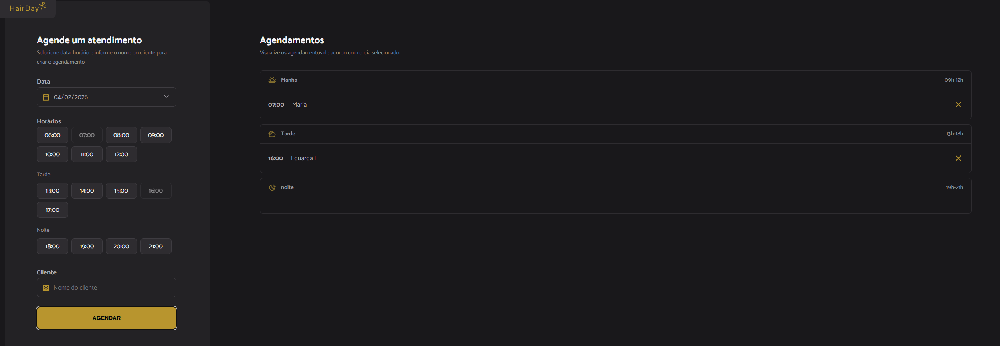

A website for scheduling.

  <a href="#-technologies">Technologies</a>&nbsp;&nbsp;&nbsp;|&nbsp;&nbsp;&nbsp;
  <a href="#-project">Project</a>

 

  

## Technologies

This project was developed using the following technologies:

- HTML
- CSS
- JavaScript

## Project

This website is a project that was developed to be a scheduling simulator.

using JavaScript techniques